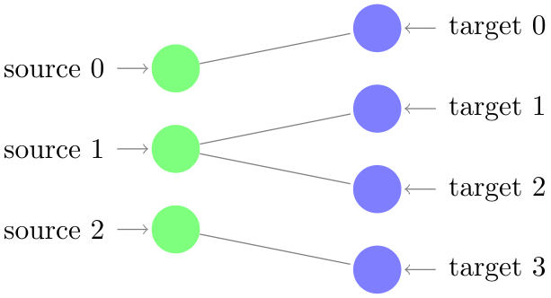

# xswap

## Usage examples

## Choice of parameters

### `directed` and `bipartite`

The `bipartite` argument determines the meaning of a node's value.
A bipartite graph is a graph in which nodes can be divided into disjoint sets with connections exclusively between sets.
For example, consider the graph shown in the figure below:

The adjacency matrix corresponding to a bipartite graph can be broken into four blocks.

The two diagonal blocks are entirely zero and the two off-diagonal blocks are the biadjacency matrix and its transpose.

The biadjacency matrix is, in general, non-square.
This means that the edge (0, 0) is not a self loop, as a 0 in the first position refers to a different node than a 0 in the second position.
