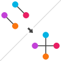

# XSwap: Fast degree-preserving network permutation




XSwap is an algorithm for degree-preserving network randomization (permutation) [1].
Permuted networks can be used for a number of purposes in network analysis, including for generating counterfactual distributions of features when only the network's degree sequence is maintained or for computing a prior probability of an edge given only the network's degree sequence.
Overall, permuted networks allow one to quantify the effects of degree on analysis and prediction methods.
Understanding this effect is useful when a network's degree sequence is subject to biases.
This implementation is a modified version of the algorithm due to Hanhijärvi et al. with two additional parameters (`allow_self_loops` and `allow_antiparallel`), which enable greater generalizability to bipartite, directed, and undirected networks.

[1] Sami Hanhijärvi, Gemma C. Garriga, Kai Puolamäki
*Proceedings of the 2009 SIAM International Conference on Data Mining* (2009-04-30) <https://doi.org/f3mn58>
DOI: [10.1137/1.9781611972795.67](https://doi.org/10.1137/1.9781611972795.67)

## Usage examples

#### Permuting an edge list

```python
>>> edges = [(0, 1), (1, 0)]
>>> permuted_edges, permutation_statistics = xswap.permute_edge_list(
        edges, allow_self_loops=True, allow_antiparallel=True,
        multiplier=10)
>>> permuted_edges
[(0, 0), (1, 1)]
>>> permutation_statistics
{'swap_attempts': 20, 'same_edge': 10, 'self_loop': 0, 'duplicate': 1,
 'undir_duplicate': 0, 'excluded': 0}
```

#### Computing degree-sequence based prior probabilities of edges existing

```python
>>> edges = [(0, 1), (1, 0)]
>>> prior_prob_df = xswap.prior.compute_xswap_priors(
        edges, n_permutations=10000, shape=(2, 2), allow_self_loops=True,
        allow_antiparallel=True)
>>> prior_prob_df
   source_id  target_id   edge  source_degree  target_degree  xswap_prior
0          0          0  False              1              1          0.5
1          0          1   True              1              1          0.5
2          1          0   True              1              1          0.5
3          1          1  False              1              1          0.5
```

## Choice of parameters

#### Bipartite networks

Bipartite networks should be indexed using the bi-adjacency matrix, meaning that the edge `(0, 0)` is from source node 0 to target node 0, and is not a self-loop.
Moreover, bipartite networks should be permuted using `allow_self_loops=False` and `allow_antiparallel=True`.

#### Directed and undirected networks

For non-bipartite networks, the decisions of `allow_self_loops` and `allow_antiparallel` are not always the same.
For undirected networks, set `allow_antiparallel=False`, as otherwise the edges (1, 0) and (0, 1), which represent the same edge, will be treated as separate.
Antiparallel edges may or may not be allowed for directed networks, depending on context.
Similarly, self-loops may or may not be allowed for directed or undirected networks, depending on the specific network being permuted.

## Libraries

The XSwap library includes Roaring Bitmaps (https://github.com/RoaringBitmap/CRoaring), available under the Apache 2.0 license (https://github.com/RoaringBitmap/CRoaring/blob/LICENSE).

## Acknowledgments

Development of this project has largely taken place in the [Greene Lab](http://www.greenelab.com/) at the University of Pennsylvania. However, as an open source project under the `hetio` organization, this repository is grateful for its community of maintainers, contributors, and users.

This work is funded in part by the Gordon and Betty Moore Foundation’s Data-Driven Discovery Initiative through Grants GBMF4552 to Casey Greene and GBMF4560 to Blair Sullivan.
